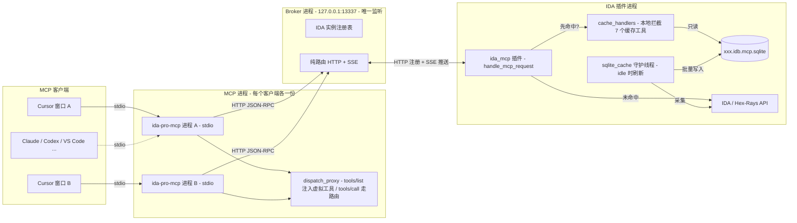
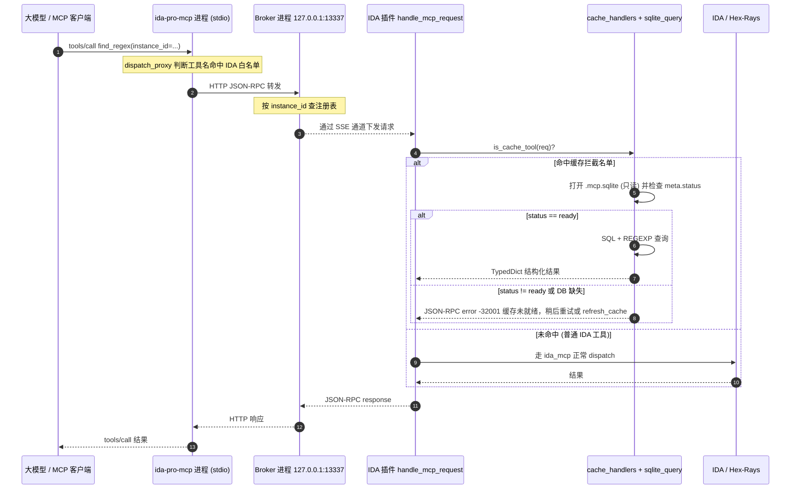
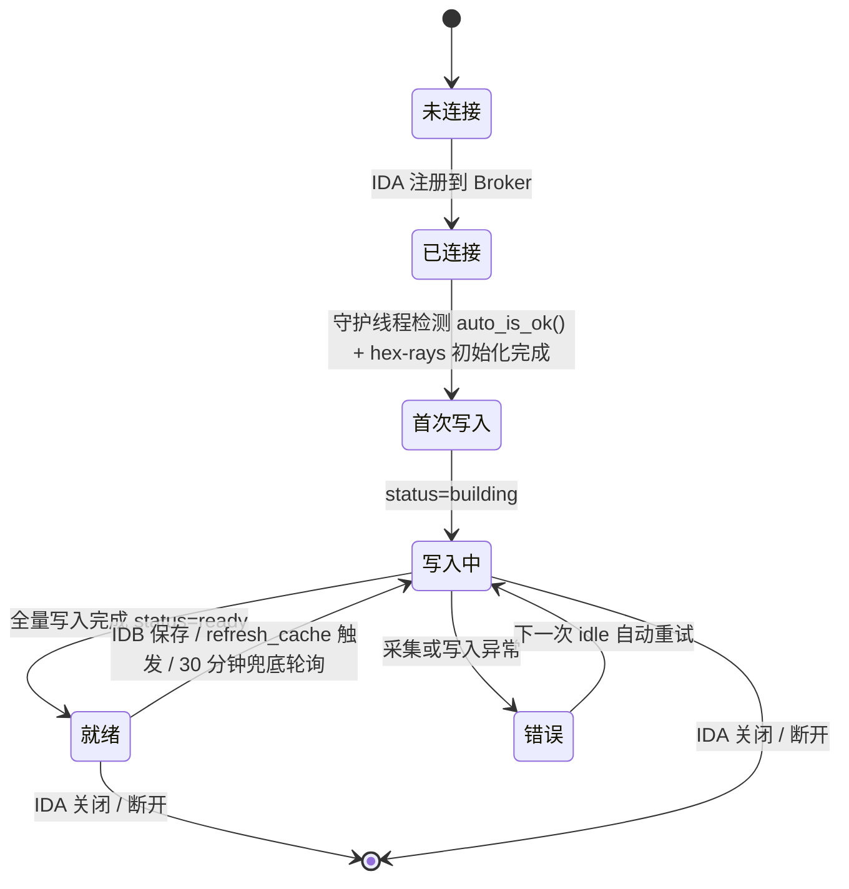

# IDA Pro MCP

> 增强版作者：**QiuChenly** · [GitHub @QiuChenly](https://github.com/QiuChenly)
>
> 基于上游 [mrexodia/ida-pro-mcp](https://github.com/mrexodia/ida-pro-mcp) 深度改造，新增 Broker 纯路由架构与客户端侧 SQLite 静态缓存接管层。

一套面向 IDA Pro 的 [MCP（Model Context Protocol）](https://modelcontextprotocol.io/introduction) 服务端，让大模型以结构化工具调用的方式读写 IDA IDB，用于逆向工程、二进制分析、Hook 开发等场景。

英文原版文档请参阅 [README.en.md](./README.en.md)。本 README 描述的是在上游之上增强过的 Broker 架构与 SQLite 静态缓存接管层。

示例视频与 prompt：见 [mcp-reversing-dataset](https://github.com/mrexodia/mcp-reversing-dataset)。

---

## 一、项目亮点（本增强版 vs. 上游）

- **Broker 进程纯路由**：独立监听 `127.0.0.1:13337`，IDA 实例与所有 MCP 客户端都只和它交互；多 Cursor 窗口、多 IDA 同时挂载不再抢端口。
- **客户端侧 SQLite 静态缓存（`xxx.idb.mcp.sqlite`）**：IDA 插件在 IDA idle 时由守护线程把字符串、函数、全局、导入、交叉引用全量落地到 IDB 旁的 SQLite 文件。
- **缓存接管 tools/call**：`find_regex / entity_query / list_funcs / list_globals / imports / refresh_cache / cache_status` 共 7 个工具在 IDA 插件进程内部被 **直接用本地 SQLite 响应**，完全不占用 IDA 主线程。
- **严格类型协议**：全部新增 API 的请求/返回走 `TypedDict`（`FindRegexArgs / FindRegexResult / ToolSchema / McpToolCallResult` 等），消除"字段是否存在"之类的不确定性。
- **Broker 注入虚拟工具**：`refresh_cache` 与 `cache_status` 作为虚拟 `ToolSchema` 追加到 `tools/list` 结果中，模型可以直接看到并调用，但它们并不在 Broker 执行，最终仍被路由到指定 IDA 实例。
- **idalib 无头模式**：通过 `idalib-mcp` 运行纯 headless 服务，支持 `--isolated-contexts` 做严格的每连接上下文隔离。

---

## 二、环境要求

- Python 3.11+（建议使用 `idapyswitch` 切换到最新 Python）
- IDA Pro 8.3+（推荐 9.0+），**不支持 IDA Free**
- 支持任意标准 MCP 客户端：Cursor / Claude / Claude Code / Codex / VS Code / Gemini CLI / Cline 等

---

## 三、安装

```bash
pip uninstall ida-pro-mcp
pip install https://github.com/QiuChenly/ida-pro-mcp-enhancement/archive/refs/heads/main.zip
```

本地开发安装：

```bash
cd ida-pro-mcp-enhancement && uv venv && uv pip install -e .
```

配置 MCP 客户端和 IDA 插件：

```bash
ida-pro-mcp --install
```

安装完成后请**完全重启** IDA 和 MCP 客户端。某些客户端（如 Claude Desktop）在后台常驻，需要从托盘图标退出。IDA 插件菜单需要先加载一个二进制文件才会出现。

---

## 四、总体架构

下面这张图描述本增强版的所有运行时组件与数据流。



关键点：

- **MCP 进程不绑端口**：每个客户端窗口自己启动一份 `ida-pro-mcp`（stdio），它们全部把请求通过 HTTP 丢给 Broker。
- **Broker 只做路由**：它不读 IDB、不读 SQLite，完全不碰业务逻辑；只负责把 JSON-RPC 请求按 `instance_id` 扔给对应的 IDA 插件，并把 SSE 回写的响应拿回来。
- **SQLite 读写都在 IDA 进程内**：写由守护线程负责（idle 触发），读由 `handle_mcp_request` 的拦截层负责（命中就查 DB，不再走 IDA API）。Broker 进程绝不 import `sqlite_cache / sqlite_query`。

---

## 五、一次 tools/call 的完整时序



缓存未就绪时**不会回退到实时 IDA API**，而是直接向模型报错并提示稍后重试或先调用 `refresh_cache`。这是一种有意的硬性语义：避免在大模型未知状态下拿到"半新半旧"数据造成误判。

---

## 六、SQLite 缓存守护线程生命周期



- 缓存文件名固定为 `<idb 路径>.mcp.sqlite`，随 IDB 一起落盘。
- `meta` 表记录 `status`（`building / ready`）、`last_updated` 等。
- 使用 WAL 模式，允许写入进行中仍被只读 `file:...?mode=ro` 连接查询（读到旧快照）。
- `cache_status` 查询不抛错：文件缺失时返回 `{exists: false, status: "missing"}`。
- **重新索引触发时机**（三种，任一满足即触发，触发后等待 IDA idle 再执行全量重建）：
  1. **IDB 保存**：IDA 每次保存数据库（Ctrl+S 或自动保存）时，`IDB_Hooks.savebase` 回调立即唤醒守护线程，确保重命名、新增函数等变更实时同步。
  2. **主动调用 `refresh_cache`**：MCP 客户端显式触发，绕过所有检查直接重建。
  3. **30 分钟兜底轮询**：定时唤醒时检查 IDB 文件 mtime，若与上次重建时一致则跳过，避免无意义的全量扫描。

---

## 七、使用方式（Broker 模式）

多窗口 Cursor、多个 IDA 实例并用时，请务必**先启动 Broker**，再启动客户端。

```bash
# 1. 先启动 Broker（保持一个终端常开）
uv run ida-pro-mcp --broker
# 或自定义端口
uv run ida-pro-mcp --broker --port 13337

# 2. 启动 Cursor/Claude/VS Code 等，它们会通过 stdio 启动
#    自己的 ida-pro-mcp 进程，并向上面的 Broker 发请求

# 3. 打开 IDA、加载二进制，按 Ctrl+Alt+M 连接到 Broker
```

### 多实例模式

同时分析多个二进制：打开多个 IDA，分别按 Ctrl+Alt+M 连上 Broker。

| 工具 | 说明 |
|------|------|
| `instance_list()` | 列出所有已连接 IDA 实例（`instance_id, name, binary_path, idb_path, base_addr`） |
| `instance_info(instance_id)` | 获取指定实例的详细信息 |

本增强版不再提供"当前活动实例"的隐式状态，也没有 `instance_switch / instance_current`。每次调用业务工具（如 `decompile`、`xrefs_to`、`find_regex` 等）时都**必须**在 `arguments` 里显式带 `instance_id`，由 Broker 精确路由到目标 IDA。这样做是为了避免多个 MCP 客户端共享同一个 Broker 时相互踩隐式状态。

---

## 八、命令行参数

| 参数 | 说明 |
|------|------|
| `--install` | 安装 IDA 插件 + 各 MCP 客户端配置 |
| `--uninstall` | 卸载 IDA 插件 + 各 MCP 客户端配置 |
| `--unsafe` | 启用调试器等不安全工具（`dbg_*`） |
| `--broker` | 仅启动 Broker（HTTP，不启动 stdio） |
| `--broker-url URL` | 当前 MCP 进程要连的 Broker 地址，默认 `http://127.0.0.1:13337` |
| `--port PORT` | Broker 监听端口，默认 13337 |
| `--transport URL` | 以 SSE 方式直接挂载到上游 MCP 传输，如 `http://127.0.0.1:8744/sse` |
| `--config` | 打印当前 MCP 配置 |

Broker 地址也可由环境变量指定：

```bash
IDA_MCP_BROKER_URL=http://127.0.0.1:13337 ida-pro-mcp
```

### 启用调试器工具

```json
{
  "mcpServers": {
    "ida-pro-mcp": {
      "command": "uv",
      "args": ["run", "ida-pro-mcp", "--unsafe"]
    }
  }
}
```

---

## 九、缓存相关工具

| 工具 | 语义 | 错误行为 |
|------|------|---------|
| `find_regex(instance_id, pattern, limit?, offset?, include_xrefs?)` | 正则搜索字符串表，含 xrefs | status != ready 时抛 `-32001` |
| `entity_query(instance_id, kind, name_pattern?, segment?, ...)` | 统一实体查询，kind ∈ `strings / functions / globals / imports` | 同上 |
| `list_funcs(instance_id, name_pattern?, ..., include_xrefs?)` | 函数列表，可带 xrefs | 同上 |
| `list_globals(instance_id, name_pattern?, ...)` | 全局变量列表 | 同上 |
| `imports(instance_id, name_pattern?, module_pattern?, ...)` | 导入表列表 | 同上 |
| `refresh_cache(instance_id)` | 唤醒目标 IDA 的缓存守护线程，立即返回 `{triggered, idb_path}` | 永不抛错 |
| `cache_status(instance_id)` | 查询缓存文件是否存在、`status`、各表计数 | 文件不存在时返回 `{exists: false, status: "missing"}` |

错误码约定：
- `-32001`：缓存未就绪 / 文件缺失
- `-32000`：未提供 `instance_id` 或没有活动 IDA 实例
- `-32602`：参数错误（如 `entity_query.kind` 非法）
- `-32603`：SQLite 查询内部异常

---

## 十、非缓存工具总览

以下工具仍走 IDA API 正常 dispatch，由插件进程通过 `@idasync` 在 IDA 主线程执行。

下列工具均为代码中真实注册的工具名（以仓库 `api_*.py` 中的 `@tool` 定义为准），若有出入请以源码为准。

### 核心查询
- `lookup_funcs(queries)` 按地址或名称获取函数
- `int_convert(inputs)` 十进制 / 十六进制 / 字节 / ASCII / 二进制互转
- `decompile(addr)` / `disasm(addr)` 反编译 / 反汇编
- `xrefs_to(addrs)` / `xref_query(queries)` / `xrefs_to_field(queries)` 交叉引用
- `callees(addrs)` 被调用函数
- `func_profile(queries)` 快速获取函数画像（prolog / 返回 / 基本块摘要等）

### 修改
- `set_comments(items)` 反汇编与伪代码视图同时写注释
- `patch_asm(items)` 汇编级补丁
- `declare_type(decls)` 在 IDB 本地类型库声明 C 类型
- `define_func(items)` / `define_code(items)` / `undefine(items)` 函数 / 代码定义控制

### 内存读取
- `get_bytes(addrs)` / `get_int(queries)` / `get_string(addrs)` / `get_global_value(queries)`

### 栈帧
- `stack_frame(addrs)` / `declare_stack(items)` / `delete_stack(items)`

### 结构体
- `read_struct(queries)` / `search_structs(filter)`

### 高级分析
- `py_eval(code)` 在 IDA 上下文执行任意 Python
- `analyze_function(addr, ...)` 单函数深入分析（反编译 + 汇编 + xrefs + 调用关系 + 基本块 + 常量 + 字符串）
- `analyze_batch(queries)` 批量版 `analyze_function`
- `analyze_component(...)` 以入口为根的组件级分析（调用树 + 数据流摘要）
- `diff_before_after(...)` 前后快照差异分析
- `trace_data_flow(...)` 数据流追踪

### 模式搜索
- `find_bytes(patterns)` 字节模式搜索（支持 `48 8B ?? ??`）
- `insn_query(queries)` 按助记符 / 操作数语义的指令序列查询
- `find(type, targets)` 立即值 / 字符串 / 数据与代码引用统一搜索

### 控制流 / 类型 / 导出 / 图
- `basic_blocks(addrs)`
- `set_type(edits)` / `infer_types(addrs)`
- `export_funcs(addrs, format)` 导出为 `json / c_header / prototypes`
- `callgraph(roots, max_depth)`

### 批量
- `rename(batch)` 函数 / 全局 / 局部 / 栈变量统一批量改名
- `patch(patches)` 批量字节修补
- `put_int(items)` 批量写整数

### 调试器（需 `--unsafe`）
- 控制：`dbg_start / dbg_exit / dbg_continue / dbg_run_to / dbg_step_into / dbg_step_over`
- 断点：`dbg_bps / dbg_add_bp / dbg_delete_bp / dbg_toggle_bp`
- 寄存器：`dbg_regs / dbg_regs_all / dbg_gpregs / dbg_regs_named / dbg_regs_remote / dbg_gpregs_remote / dbg_regs_named_remote`
- 栈 / 内存：`dbg_stacktrace / dbg_read / dbg_write`

---

## 十一、MCP 资源（只读状态）

按 MCP 规范暴露的 `ida://` 资源：

- `ida://idb/metadata` IDB 元数据（路径、架构、基址、哈希）
- `ida://idb/segments` 段与权限
- `ida://idb/entrypoints` 入口点（main / TLS 回调等）
- `ida://cursor` 当前光标 + 所在函数
- `ida://selection` 当前选区
- `ida://types` 本地类型
- `ida://structs` 所有结构 / 联合
- `ida://struct/{name}` 结构字段
- `ida://import/{name}` 按名查导入
- `ida://export/{name}` 按名查导出
- `ida://xrefs/from/{addr}` 从地址出发的交叉引用

---

## 十二、SSE 传输与无头 idalib

直接以 SSE 方式对外提供服务：

```bash
uv run ida-pro-mcp --transport http://127.0.0.1:8744/sse
```

无头（需安装 [`idalib`](https://docs.hex-rays.com/user-guide/idalib)）：

```bash
uv run idalib-mcp --host 127.0.0.1 --port 8745 path/to/executable
# 严格的每连接上下文隔离
uv run idalib-mcp --isolated-contexts --host 127.0.0.1 --port 8745 path/to/executable
```

`--isolated-contexts` 的语义：

- 每个传输上下文（`/mcp` 的 `Mcp-Session-Id`、`/sse` 的 `session`、stdio 的 `stdio:default`）都有自己独立的 session 绑定。
- 未绑定上下文调用 IDB 依赖工具会直接失败，避免跨 Agent 误操作。
- 多 Agent 想共享同一 session 时，通过 `idalib_switch(session_id)` 主动加入即可。

上下文管理工具：

- `idalib_open(input_path, ...)` 打开并绑定
- `idalib_switch(session_id)` 切换绑定
- `idalib_current()` 查当前绑定
- `idalib_unbind()` 解绑
- `idalib_list()` 列表，带 `is_active / is_current_context / bound_contexts`

---

## 十三、提示工程建议

大模型在进制转换、数学计算、混淆代码上容易出错。务必：

- 明确要求使用 `int_convert` 工具做进制转换，不要让模型手算。
- 必要时配合 [math-mcp](https://github.com/EthanHenrickson/math-mcp) 做复杂运算。
- 混淆代码先做预处理再交给 LLM：字符串解密、导入哈希、控制流平坦化、代码加密、反反编译技巧。
- 用 Lumina 或 FLIRT 把开源库、C++ STL 先解掉。

一个适用于 crackme 场景的最小提示：

```md
你的任务是在 IDA Pro 中分析一个 crackme。你可以使用 MCP 工具获取信息。总体策略：

- 先用 decompile / disasm 审阅反编译与汇编
- 对可疑代码加注释，然后把变量、参数、函数重命名为具有描述性的名字
- 必要时修正类型（尤其是指针、数组）
- 绝对不要自己做进制转换，一律用 int_convert
- 不要暴力破解，只从反汇编和简单 python 脚本中推导结论
- 分析完成后写一份 report.md，最后把找到的密码交给用户确认
```

---

## 十四、常见问题

**Q：IDA 插件连接失败 / `instance_list` 空？**

1. 先单独启动 Broker：`uv run ida-pro-mcp --broker`（保持运行）
2. 再启动 Cursor / Claude / VS Code 等
3. 在 IDA 里按 Ctrl+Alt+M 连接
4. 如端口冲突：`ida-pro-mcp --broker --port 13338`，并确保 IDA 插件与 MCP 客户端的 `broker-url` 一致

**Q：调用 `find_regex / list_funcs` 等返回 `-32001`？**

说明本地 `.mcp.sqlite` 还没写好，属于正常初始化期。可以：

- 调用 `cache_status(instance_id=...)` 查看 `status` 与各表计数。
- 调用 `refresh_cache(instance_id=...)` 主动唤醒缓存守护线程。
- 稍等片刻后重试。

**Q：缓存文件在哪？能删吗？**

就在 IDB 旁边：`<idb 路径>.mcp.sqlite`（和 `.mcp.sqlite-wal / -shm` 同目录）。随时可删；下次 IDA idle 时会重建。

**Q：`uv pip install -e .` 提示 "Failed to clone files; falling back to full copy"？**

这只是 uv 的 warning（reflink 跨卷失败），构建其实成功。本项目 `pyproject.toml` 已内置 `[tool.uv] link-mode = "copy"` 消除该提示。

**Q：支持 IDA Free 吗？**

不支持，IDA Free 没有插件 API。

**Q：按 G 键跳转失败？**

请更新到最新版本后重启 IDA：

```bash
uv pip install -e .
```

---

## 十五、开发

核心实现位置：

- `src/ida_pro_mcp/server.py` 主 MCP 服务端入口（stdio / broker 双模式分发）
- `src/ida_pro_mcp/idalib_server.py` idalib 无头服务端
- `src/ida_pro_mcp/ida_mcp.py` IDA 插件入口与 `handle_mcp_request`
- `src/ida_pro_mcp/ida_mcp/api_*.py` 所有业务工具与资源（纯 IDA 侧）
- `src/ida_pro_mcp/broker/server.py` Broker HTTP + 注册表 + SSE
- `src/ida_pro_mcp/broker/manager.py` `dispatch_proxy` 路由 + 虚拟工具注入
- `src/ida_pro_mcp/broker/sqlite_cache.py` 插件侧 idle 守护 + 写入
- `src/ida_pro_mcp/broker/sqlite_query.py` 插件侧只读查询（强类型）
- `src/ida_pro_mcp/broker/cache_handlers.py` `tools/call` 的本地缓存拦截
- `src/ida_pro_mcp/broker/cache_types.py` 全部协议 `TypedDict`（`JsonRpcRequest / Response / Error / ToolSchema / *Args / *Result`）

新增工具只需：

1. 在对应的 `api_*.py` 里写一个 `@tool` + `@idasync` 函数，带完整 Python 类型注解；
2. 用 `Annotated[...]` 写参数说明，函数 docstring 就是暴露给模型的 tool description；
3. MCP 服务端会自动扫描 `api_*.py` 并注册，无需手动改 schema。

运行测试：

```bash
uv run ida-mcp-test tests/crackme03.elf -q
uv run ida-mcp-test tests/typed_fixture.elf -q
```

MCP inspector 调试：

```bash
uv run mcp dev src/ida_pro_mcp/server.py
```

覆盖率：

```bash
uv run coverage erase
uv run coverage run -m ida_pro_mcp.test tests/crackme03.elf -q
uv run coverage run --append -m ida_pro_mcp.test tests/typed_fixture.elf -q
uv run coverage report --show-missing
```

---

## 十六、与其它 IDA MCP 的差异

市面上已有数个 IDA Pro MCP 实现，本仓库在上游 [mrexodia/ida-pro-mcp](https://github.com/mrexodia/ida-pro-mcp) 的基础上重点做了两件事：

- 把 Broker 做成纯路由，解决多客户端并发问题；
- 在客户端侧引入 SQLite 静态缓存，把高频只读查询从 IDA 主线程移走，让大模型在大规模分析场景下不再因 IDA API 往返而被拖慢。

其他实现（便于对比选型）：

- https://github.com/mrexodia/ida-pro-mcp 上游
- https://github.com/taida957789/ida-mcp-server-plugin 仅 SSE，IDAPython 装依赖
- https://github.com/fdrechsler/mcp-server-idapro TypeScript，新增功能需大量样板
- https://github.com/MxIris-Reverse-Engineering/ida-mcp-server 自定义 socket，样板重

欢迎 PR 补充。

---

## 十七、许可证

见 [LICENSE](./LICENSE)。

---

## 署名

- **增强版维护者**：[QiuChenly](https://github.com/QiuChenly)
- **上游原作者**：[mrexodia](https://github.com/mrexodia)

本项目在上游 `ida-pro-mcp` 的基础上由 QiuChenly 增强实现 Broker 路由架构、SQLite 静态缓存接管与严格类型协议等特性。如在论文、博客或工具中使用，请同时署名上游作者与本增强版作者。
